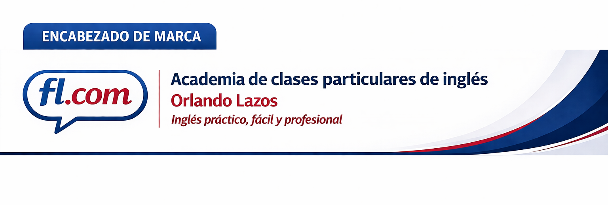
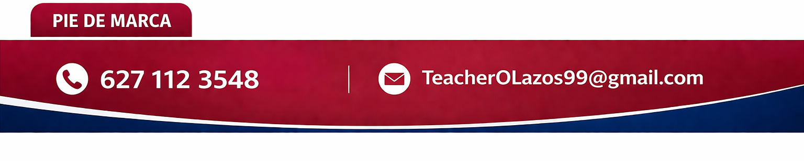

Esta nota aterriza cómo debe posicionarse la marca frente a otras alternativas del mercado, con énfasis en precio, personalización, perfil profesional del profesor y uso estratégico de tecnología.

#   Mi branding será un branding personal. 

Esto es conveniente porque el servicio no gira alrededor de una institución impersonal ni de una operación masiva, sino alrededor de la relación directa entre profesor y estudiante. En clases particulares de inglés, una parte importante del valor percibido no está solo en el contenido, sino en quién enseña, cómo acompaña, cómo explica y qué confianza transmite. Por eso, una identidad personal tiene coherencia con la naturaleza real del servicio: el estudiante no solo contrata clases de inglés, sino también mi criterio, mi estilo de enseñanza, mi trato, mi experiencia y mi capacidad de adaptar cada sesión a sus necesidades.

Además, un branding personal ayuda a diferenciarme en un mercado donde muchas opciones se ven genéricas o intercambiables. Mientras otros servicios pueden presentarse como “academias” o “cursos” con una imagen más fría o distante, una marca personal puede comunicar cercanía, confianza, responsabilidad y atención individual. Eso fortalece la percepción de personalización real, que justamente es uno de los pilares de la propuesta de valor. Si la clase es particular, flexible y centrada en la persona, tiene sentido que la identidad de la marca también refleje esa cercanía humana.

También es una decisión estratégica porque facilita construir reputación a partir de mi propia trayectoria. Mi formación, mi experiencia con el idioma, mi perfil profesional y mi manera de enseñar pueden convertirse en activos visibles de la marca. En lugar de esconder a la persona detrás del servicio, el branding personal permite convertir al profesor en una evidencia viva de la propuesta de valor. Eso hace más creíble la marca, especialmente en un servicio educativo donde la confianza, la claridad y la conexión humana influyen mucho en la decisión de compra y en la permanencia del estudiante.

#   Identidad visual de la marca

##   Imagen de marca

El negocio es de profesional independiente, por lo tanto la mejor imagen de marca es una imagotipo: mi rostro, con un logo de lo que hago, que en este caso es ser profesor de lengua de inglés por lo tanto le puse language teacher. Esta imagen la tendré en mis diferentes redes sociales en donde haga publicidad.

Además del imagotipo personal utilizaré también un logotipo sencillo. Va, te dejo una descripción clara y usable (tipo profesional):

---

##    logotipo

Descripción de logotipo (versión final). Logotipo minimalista compuesto por un **ícono de burbuja de diálogo**, que representa la comunicación, el lenguaje y la interacción verbal. En su interior se integra el texto **“FL.com”**, donde:
  * **“F” y “L” en mayúsculas**, estilizadas con una tipografía limpia y moderna
  * **“.com” en minúsculas**, generando contraste visual y jerarquía

El diseño utiliza una **línea simple y elegante**, con un enfoque minimalista que lo hace fácilmente reconocible y adaptable a distintos formatos.
¶	  El archivo se presenta en formato **PNG (Portable Network Graphics) con canal alfa (alpha channel)**, lo que permite un **fondo transparente**. Esto facilita su uso sobre cualquier color o imagen sin bordes visibles.

##   creativos de marca

En Facebook voy a poner una portada que comuniqué:
- Escuela de inglés para competencias conversacionales y profesionales, una foto mia con IA.
  - En un diagrama poner los *2 cursos* que hay:
  1. *Competencia conversacionales*, 72 lecciones
  2. *Competencias Profesionales*, 4 módulos
- Estudia con profesor:
  - *Certificado* en la enseñanza de inglés por Cambridge
  - *y con 5 años de experiencia* en diferentes roles bilingües
- Clases asistidas por IA

##    Encabezado y pie de marca

“Encabezado de marca” y “pie de marca” no suelen ser términos técnicos rígidos y universales, sino términos descriptivos de diseño. En esta nota conviene separarlos porque cumplen funciones distintas dentro de la identidad visual: el encabezado presenta la marca y el pie concentra los datos de contacto.

###     Encabezado de marca

Se integra de:
- logotipo
- nombre identificador del negocio
- nombre del representante
- slogan

###     Pie de marca

Se integra de:
- número telefónico
- correo de contacto
- continuidad visual con la paleta de la marca

#   Identidad verbal

##    Nombre del negocio

"Academia de Inglés Particular con Orlando". El nombre Academia de Inglés Particular refleja un enfoque educativo especializado, personalizado y orientado a resultados reales. Se elige el término “academia” porque comunica formación estructurada, desarrollo de competencias y un proceso de aprendizaje con continuidad, más allá de clases aisladas.

A diferencia de una simple oferta de tutorías, esta academia organiza el aprendizaje en programas definidos, como el curso de inglés conversacional y el curso de inglés profesional, los cuales siguen una progresión lógica. Esto transmite seriedad, dirección y propósito formativo.

El término “particular” refuerza el valor diferencial del servicio: atención directa, acompañamiento cercano y adaptación al ritmo y objetivos del estudiante. No se trata de educación masiva, sino de una experiencia enfocada en cada persona.

En conjunto, el nombre proyecta una propuesta clara: formación especializada con estructura de academia, pero con la cercanía y personalización de un profesor independiente.

##    Slogan

Inglés práctico, fácil y profesional.

#    Posicionamiento

La marca quiere ocupar el lugar de una opción de *alto valor accesible*: clases de inglés particulares, totalmente online y personalizadas, con un precio mucho más asequible que el de muchos profesores particulares consolidados, pero sin caer en el modelo económico de baja personalización que suele ofrecer el mercado masivo.

No se busca competir por ser “lo más barato”, sino por ofrecer *la mejor relación entre precio, personalización y calidad profesional*. La promesa central es que el estudiante puede acceder a clases particulares de buen nivel sin tener que pagar precios premium ni resignarse a grupos numerosos donde la atención individual se pierde.

##    Diferenciación frente al mercado 

###     Frente a cursos económicos masivos

Muchos cursos económicos logran bajar su precio porque trabajan con grupos de más de seis personas. Eso reduce costos, pero también reduce atención individual, adaptación real al nivel del estudiante y profundidad del acompañamiento. La marca se diferencia porque mantiene un precio accesible sin sacrificar el carácter particular de la clase ni las ventajas de trabajar directamente con un profesor.

###     Frente a profesores particulares de precio alto

También existen profesores particulares que, por visibilidad, trayectoria o posicionamiento previo, cobran entre *300 y 500 pesos por hora*. Frente a ese segmento, la marca se posiciona como una alternativa mucho más asequible, con un precio promedio cercano a *120 pesos por hora*, manteniendo al mismo tiempo una propuesta seria, profesional y personalizada.

##    Factores que sostienen el posicionamiento

- `Precio accesible con personalización real`: la clase sigue siendo particular y adaptada al estudiante.
- `Modalidad totalmente online`: comodidad, flexibilidad y continuidad sin perder acompañamiento.
- `Perfil profesional del profesor`: no solo hay experiencia docente, sino también formación lingüística y profesional.
- `Experiencia bilingüe aplicada`: se suma experiencia laboral en contextos bilingües y experiencia de vida en Estados Unidos.
- `Uso competente de tecnología`: la clase puede enriquecerse con diagramas, materiales visuales, videos, recursos digitales y herramientas que hacen más clara y más rica la explicación.
- `Integración de inteligencia artificial con criterio profesional`: la IA no sustituye al profesor, sino que amplía su capacidad para generar materiales, ejemplos, explicaciones y apoyos de mayor calidad, guiados por una persona con criterio lingüístico y docente.

##    Formulación refinada del posicionamiento

Fluent Language.com se posiciona como una opción de clases de inglés particulares y totalmente online que ofrece una relación sobresaliente entre precio, personalización y calidad. La marca se diferencia tanto de los cursos económicos masivos, que abaratan costos sacrificando atención individual, como de los profesores particulares de precio alto, que suelen quedar fuera del alcance de muchos estudiantes. Su propuesta combina precio accesible, formación lingüística, experiencia bilingüe real y un uso profesional de tecnología e inteligencia artificial para ofrecer clases más claras, más ricas y más útiles para el estudiante.
