Esta nota reúne criterios reusables para pensar, definir y revisar el branding del proyecto sin depender de una campaña o pieza específica.

#   Principles of cohesion and coupling / scope

##    Cohesion

- Definir qué papel cumple el branding dentro del proyecto.
- Reunir componentes base para construir una marca coherente.
- Servir como referencia reusable para mensajes, identidad y decisiones de percepción.

##    Coupling

- Se complementa con `5_marketing-glossary.md` para vocabulario y definiciones cercanas.
- Puede alimentar descripciones comerciales, mensajes clave, lineamientos visuales y materiales de promoción.
- No sustituye campañas, calendarios ni piezas concretas que deban vivir en `3_Files`.

#   Definiciones del Branding

##    Qué es

El branding es el trabajo intencional de definir cómo una marca quiere ser percibida y qué señales usa para sostener esa percepción con consistencia.

El branding puede clasificarse según sobre quién trate:
1. *Personal*: La marca gira alrededor de una persona
2. *Corporativo/empresarial*: (Una empresa es una identidad asociada principalmente al negocio de actividades económicas y trabaja para la rentabilidad financiera)
3. *Institucional*: (Una institución se asociada más a entidades con fines sociales qué mercantiles, aunque pueden ser lucrativas su misión no es financiera sino trabajar por sus *intereses vocacionales*)

> Nota
> *Vocación*: Tendencia profunda y relativamente estable de una persona hacia una actividad, función, misión o modo de servir, que percibe como valioso o acorde con su identidad. *Interés vVocación*: Tendencia profunda y relativamente estable de una persona hacia una actividad, función, misión o modo de servir, que percibe como valioso o acorde con su identidad.

##    Objetivo

- Lograr que la marca sea clara, reconocible y confiable para el público correcto.
- Traducir la propuesta de valor en una identidad verbal, visual y estratégica coherente.
- Reducir contradicciones entre lo que el proyecto promete, comunica y hace.

##    Componentes base

- `Posicionamiento`: lugar que la marca quiere ocupar en la mente del público frente a otras alternativas.
- `Identidad verbal`: tono, vocabulario, promesa, mensajes clave y forma de expresarse.
- `Identidad visual`: señales visuales que ayudan a reconocer y recordar la marca.
- `Consistencia`: repetición intencional de criterios para que la percepción no cambie de forma caótica.
- `Experiencia`: Aquí experiencia significa cómo vive realmente la marca una persona cuando interactúa con ella.
    - No es lo que la marca dice de sí misma, sino lo que el público siente, nota y concluye al tratar con ella. Por ejemplo:
    - si la marca promete ser profesional, la experiencia debe sentirse profesional en los mensajes, clases, pagos, puntualidad y materiales

##    Preguntas guía

- ¿Qué promete la marca de forma creíble?
- ¿Para quién está construida y para quién no?
- ¿Qué percepción queremos provocar?
- ¿Qué rasgos deben notarse al leer, ver o escuchar la marca?
- ¿Qué evidencias reales sostienen esa promesa?

##    Entregables frecuentes

- Descripción comercial.
- Propuesta de valor.
- Mensajes clave.
- Tono de voz.
- Rasgos de personalidad de marca.
- Criterios visuales base.

##    Límites

- Branding no es solo diseño visual.
- Branding no reemplaza la calidad real del servicio u oferta.
- Branding sin consistencia operativa produce una percepción frágil o contradictoria.

#     Identidad visual de negocio(símbolo o imagen de marca)

## 🧠 Identidad visual (símbolo de marca): qué es y tipos

Sí, puedo ayudarte.
Riesgo real: confundir términos (logo vs. marca completa).
Recomendación: piensa primero en **cómo quieres que te perciban**, luego eliges el tipo.

---

## 🔹 ¿Qué es la “imagen de marca” (en este contexto)?

Aquí hablamos **solo del símbolo visual** que representa tu marca.
Técnicamente se llama:

👉 **Identificador visual de marca**

Es la “cara” de tu negocio: lo que la gente reconoce **sin leer mucho**.

---

## 🔹 Tipos principales de identificadores visuales

### 1. Logotipo (solo texto)

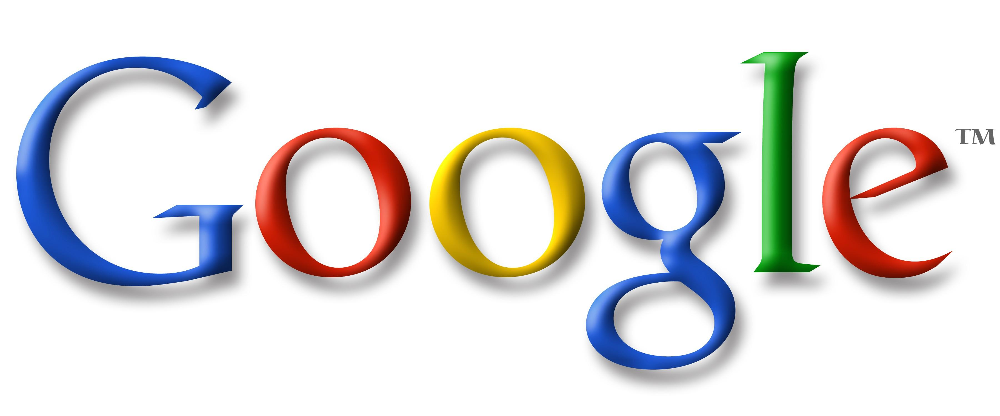

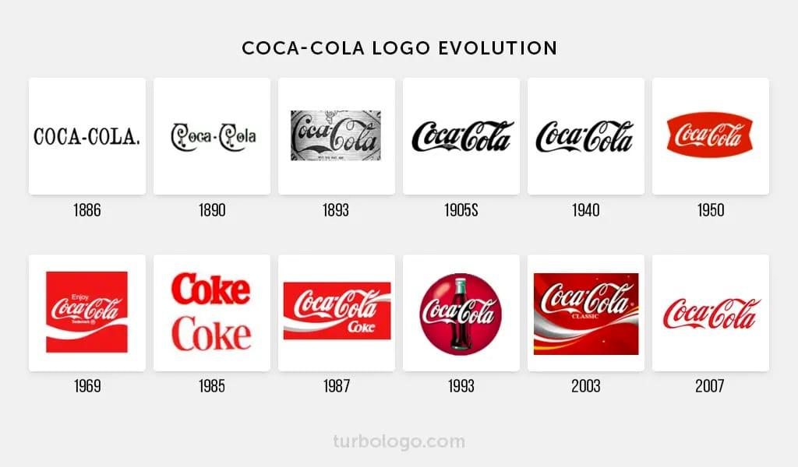

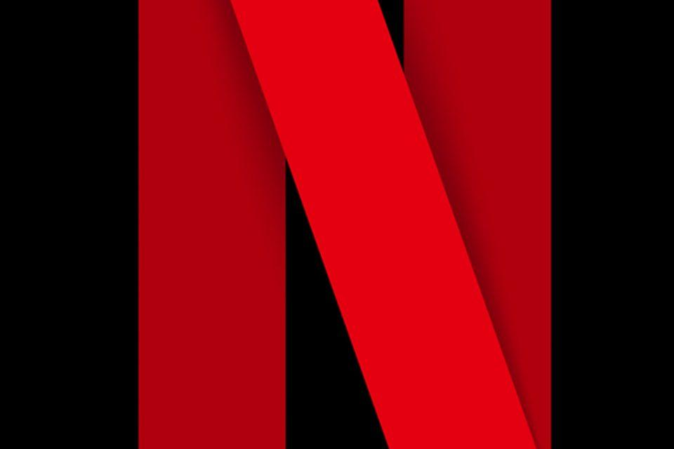

**Definición:** Marca basada únicamente en letras (nombre).

**Ejemplos:** Google, Coca-Cola, Netflix

**Cuándo usarlo:**

* Nombre fuerte y fácil de recordar
* Quieres que el nombre sea protagonista

**Ventajas:**

* Claridad total (no hay confusión)
* Fácil de registrar/legalmente

**Desventajas:**

* Depende 100% del nombre
* Menos “visual” o emocional

---

### 2. Isotipo (solo símbolo)

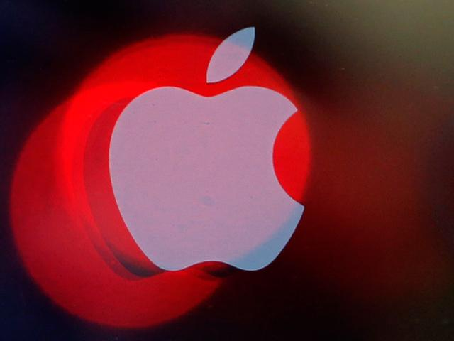

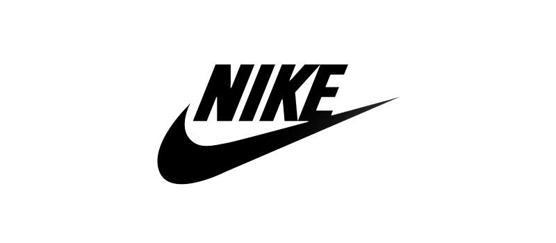

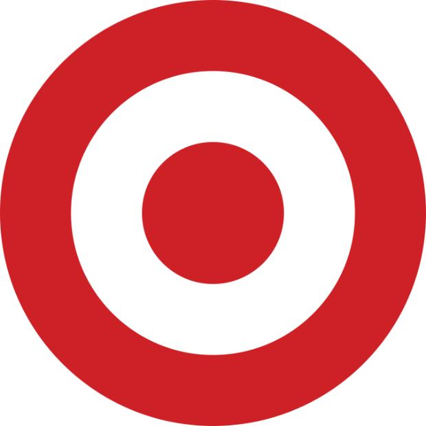

**Definición:** Símbolo sin texto.

**Ejemplos:** Apple, Nike

**Cuándo usarlo:**

* Marca ya conocida
* Buscas algo muy visual y simple

**Ventajas:**

* Muy memorable
* Funciona globalmente (sin idioma)

**Desventajas:**

* Al inicio nadie sabe qué es
* Requiere inversión en posicionamiento

---

### 3. Imagotipo (texto + símbolo separados)

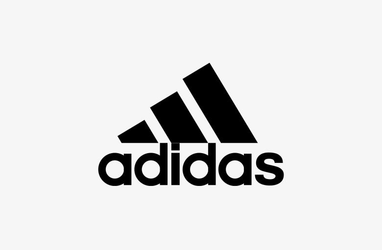

**Definición:** Texto + símbolo, pero pueden usarse por separado.

**Ejemplos:** Adidas, Spotify

**Cuándo usarlo:**

* Quieres flexibilidad
* Estás construyendo marca desde cero

**Ventajas:**

* Puedes usar solo el símbolo después
* Equilibrio entre claridad y diseño

**Desventajas:**

* Más complejo de diseñar
* Requiere coherencia en uso

---

### 4. Isologo (texto + símbolo fusionados)

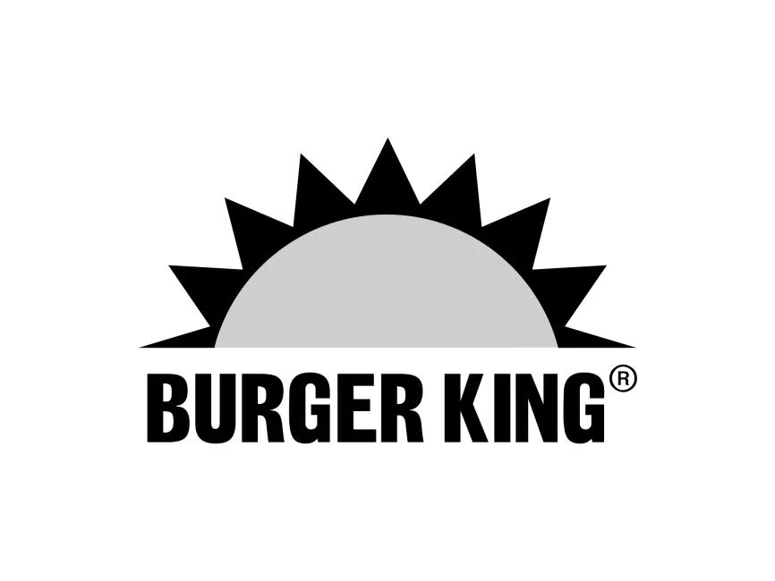

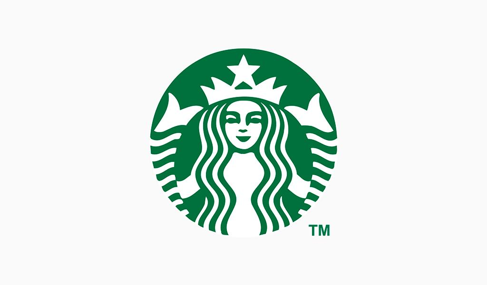

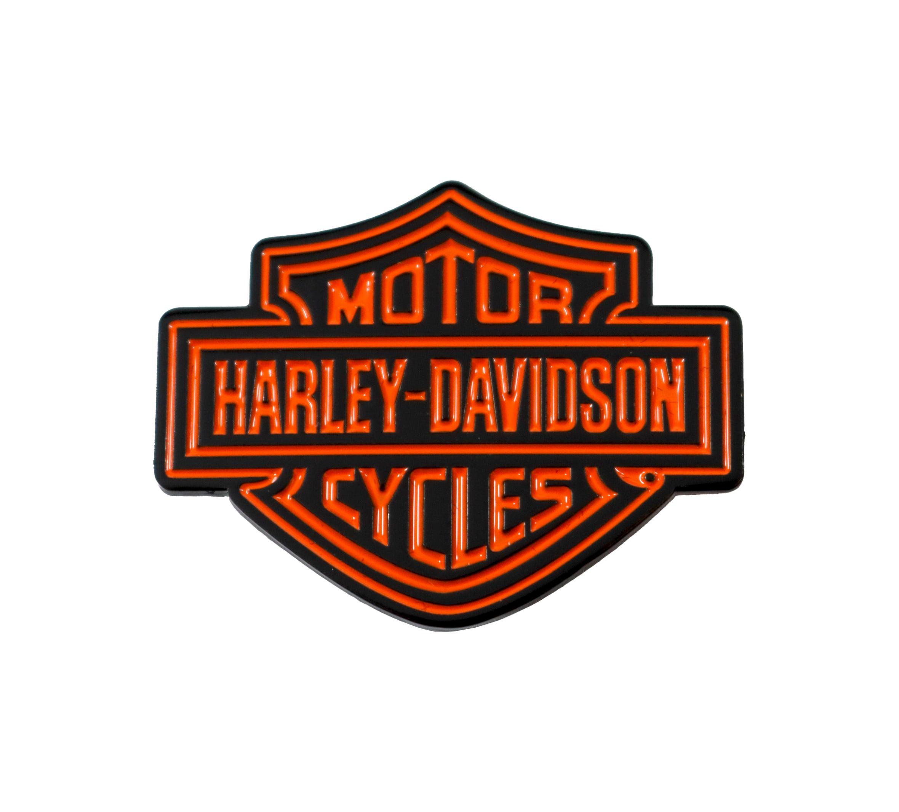

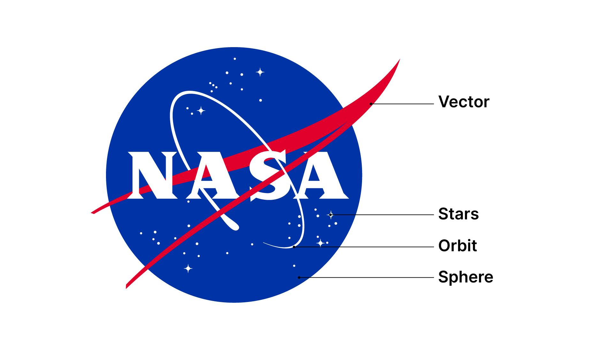

**Definición:** Todo está unido, no se puede separar.

**Ejemplos:** Burger King, Starbucks

**Cuándo usarlo:**

* Quieres una imagen compacta
* Buscas estilo “sello” o institucional

**Ventajas:**

* Muy sólido visualmente
* Se percibe formal/profesional

**Desventajas:**

* Poco flexible
* Difícil adaptar en espacios pequeños

---

## 🔹 Otros tipos (menos comunes pero útiles)

* **Monograma:** iniciales (ej. HP)
* **Mascota:** personaje (ej. Duolingo)
* **Emblema:** estilo escudo/sello (muy institucional)

---

## 🎯 ¿Cuál te conviene para una escuela de inglés?

Recomendación directa:

👉 **Imagotipo**

¿Por qué?

* Necesitas que la gente lea el nombre (al inicio)
* Pero también quieres un símbolo (para redes, perfil, etc.)

Ejemplo aplicado:

* Nombre: *Fluent Path*
* Símbolo: una flecha, camino, globo, chat, etc.
* Luego puedes usar solo el símbolo en perfil

---

## 🔑 Regla clave

> Si nadie te conoce → usa texto
> Si quieres escalar → añade símbolo

---

Si quieres, en el siguiente paso podemos:

* Generar nombres alineados con tu branding
* Proponer ideas concretas de logo para tu escuela
* O incluso diseñar conceptos visuales 👌

