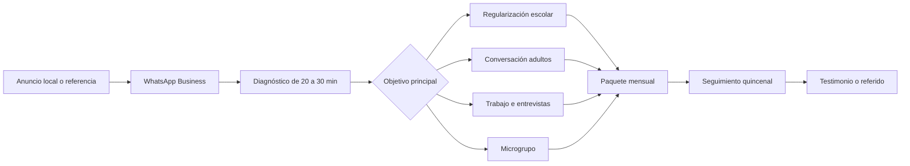
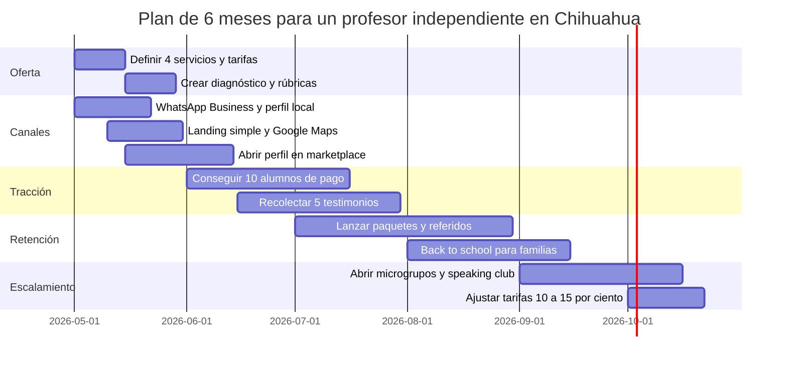

# Estudio de mercado para clases de inglés en Chihuahua

## Resumen ejecutivo

El mercado de clases de inglés en Chihuahua es suficientemente grande y, sobre todo, está incompletamente atendido. Solo por volumen educativo, el estado reúne 1,001,891 estudiantes en el sistema educativo 2024-2025, de los cuales 694,249 están en educación básica, 161,512 en media superior y 146,130 en superior; a nivel nacional la base es de 34,370,623 estudiantes. Al mismo tiempo, la evidencia disponible sigue mostrando una brecha fuerte en dominio real del idioma: un estudio con datos de una encuesta de entity["organization","INEGI","Mexico statistics agency"] encontró que menos del 10% de las personas encuestadas reportó hablar inglés, y estimó una prima salarial de 19.4% asociada con dominarlo. En otras palabras, el inglés sigue siendo escaso, pero económicamente valioso. citeturn34view3turn33view4turn44view0

La señal local es clara. México aparece en el _EF EPI 2025_ (Education First. English Proficiency Index) con nivel “muy bajo” y lugar 103 de 123 países o regiones; dentro del país, el estado de Chihuahua registró 438 puntos, también en nivel “muy bajo”, mientras que la ciudad de Chihuahua alcanzó 503 puntos, nivel “medio”. Esa combinación importa: el estado todavía tiene una brecha grande, pero la capital ya muestra una base urbana con mejor disposición y mayor exposición al idioma. Además, la Agenda Estatal de Inglés evaluó de forma diagnóstica a más de 11,500 estudiantes y 526 docentes, y el municipio abrió becas de inglés en línea para 1,000 personas con una cuota única de 80 USD, lo que confirma demanda latente y sensibilidad al precio. citeturn45view0turn30view0turn46search0turn46search6

Para un profesor independiente no certificado, la mejor jugada no es competir de frente por “credenciales”, sino por flexibilidad, cercanía, claridad comercial y resultados prácticos. La oferta formal está fragmentada: el estado tiene 94 escuelas privadas de idiomas registradas en la fuente derivada del DENUE, 63.8% con entre 0 y 5 personas ocupadas, y 73.4% concentradas en dos municipios. En paralelo, las plataformas de tutoría muestran un mercado atomizado con referencias de alrededor de 164 a 174 pesos por hora en Superprof, 191 pesos por hora en Ciudad Juárez y 226 pesos por hora en Chihuahua en Preply, además de anuncios muy baratos y otros claramente premium. Esto favorece una propuesta de valor centrada en conversación, regularización escolar, inglés para trabajo y seguimiento visible del progreso. citeturn19search1turn35search2turn35search5turn36search1turn36search8

## Alcance, método y supuestos

Este informe priorizó estadísticas y publicaciones de entity["organization","SEP","mexico education ministry"], entity["organization","CONEVAL","mexico social policy eval"] y la entity["organization","Secretaría de Economía","mexico economy ministry"], y las complementó con gobierno estatal y municipal, job boards y plataformas de tutoría. Como no existe un registro oficial de transacciones de clases privadas de inglés, la demanda se estimó con cuatro proxys: tamaño de la población estudiantil, brecha de dominio/proficiencia, señales de demanda laboral y evidencia observable de oferta y precios. La principal laguna es que no se identificó una medición oficial reciente y comparable, a nivel estatal o municipal, del porcentaje de personas que hablan inglés; por eso la cifra de prevalencia se trata como evidencia histórica y el EF EPI se usa solo como proxy relativo del dominio actual. citeturn34view3turn40view0turn44view0turn30view0

La consecuencia práctica de este método es importante: el estudio no mide cuántas personas “quieren comprar” clases particulares hoy en Chihuahua, porque ese dato no existe en fuente pública robusta; lo que sí puede medir con bastante rigor es si hay base poblacional, incentivos económicos, rezago educativo, competencia visible y canales efectivos de adquisición. Para un negocio individual, esos son los indicadores más útiles para tomar decisiones de posicionamiento y precio. citeturn34view3turn44view0turn31view1turn19search1

## Demanda actual y tamaño del mercado

La base de mercado es amplia incluso antes de entrar en nichos laborales. En Chihuahua hay 1,001,891 estudiantes en el sistema educativo; 694,249 están en básica, 161,512 en media superior y 146,130 en superior. Eso significa que el volumen escolar por sí solo ya permite pensar en tres mercados diferentes: apoyo a niñas, niños y adolescentes; transición bachillerato-universidad; y empleabilidad universitaria/profesional. Además, la cobertura educativa estatal sigue dejando espacio para apoyo extraescolar: en media superior, la tasa neta de escolarización estatal fue 62.5%, muy cercana pero ligeramente debajo del referente nacional de 62.7%, y la cobertura total estatal fue 77.7% frente a 80.6% nacional, lo que sugiere margen para servicios de refuerzo, nivelación y preparación adicional. citeturn34view3turn34view0

Más importante que el volumen es el rezago. La revisión sistemática de resultados de exámenes de inglés en México reporta que en secundaria solo 3% del alumnado alcanza B1, que es el nivel esperado al egresar según PRONI; otra investigación reciente sobre primaria pública subraya que solo 16% de las escuelas primarias cuenta con un docente PRONI. Eso no significa que el resto “no estudie” inglés; significa que una gran parte del mercado potencial llega a secundaria, preparatoria o universidad con bases débiles, discontinuas o desiguales. Para un profesor particular, esa discontinuidad no es un problema: es exactamente la oportunidad de mercado. citeturn20search10turn20search18

| Indicador base | México | Chihuahua | Lectura comercial |
|---|---:|---:|---|
| Alumnado total 2024-2025 | 34,370,623 | 1,001,891 | El mercado escolar tiene escala suficiente |
| Educación básica | 23,358,341 | 694,249 | Mercado fuerte para regularización y apoyo a familias |
| Educación media superior | 5,492,491 | 161,512 | Mercado para preparación académica y transición |
| Educación superior | 5,519,791 | 146,130 | Mercado para empleabilidad, entrevistas y speaking |
| Personas usuarias de internet | 83.1% | 85.2% | Venta y servicio online/híbrido son viables |
| EF EPI 2025 | 440, “muy bajo” | Estado: 438, “muy bajo”; ciudad de Chihuahua: 503, “medio” | Brecha amplia, pero mejor tracción urbana en la capital |

Fuente de la tabla: citeturn33view4turn34view3turn31view1turn45view0turn30view0

La prevalencia de hablantes de inglés sigue siendo baja a escala nacional. El dato más utilizable y metodológicamente claro para prevalencia proviene del estudio con encuesta de bienestar de 2014 analizado por Charles-Leija y Torres García: menos del 10% manifestó hablar inglés. Eso implica que más de 90% no lo hablaba en esa medición. No se encontró una estadística oficial reciente equivalente para Chihuahua ciudad o para el estado; por eso, para lectura actual conviene complementar con EF EPI: México está en nivel muy bajo, Chihuahua estado también, y la capital mejora a nivel medio. En términos de negocio, eso describe un mercado no saturado por dominio real, aunque sí saturado por oferta declarada. citeturn44view0turn45view0turn30view0

La demanda laboral refuerza esa lectura. En la revisión de vacantes visibles, entity["company","OCC","job board, mexico"] mostraba 43 resultados para “bilingüe” en Chihuahua, mientras entity["company","Indeed","job board"] listaba puestos como recepcionista bilingüe, atención al cliente, maestra de inglés, administrativos y posiciones operativas con requisito o deseable de inglés. A la vez, el PIB estatal 2024 se repartió casi por mitades entre actividades secundarias (43.6%) y terciarias (43.7%), una estructura que favorece nichos como inglés para manufactura, compras, logística, atención al cliente, ventas y supervisión. citeturn14search0turn14search1turn14search8turn26search10

## Perfil demográfico y segmentación útil

La demografía estatal favorece una estrategia urbana, modular y por etapas de vida. Las proyecciones estatales publicadas por el gobierno de Chihuahua muestran 680,275 personas de 10 a 19 años, 688,746 de 20 a 29 años y 1,599,145 de 30 a 59 años. El estado reporta escolaridad promedio de 10.2 años, por encima del promedio nacional de 9.7. Además, la población se concentra en pocas ciudades y el propio análisis demográfico estatal describe una fuerte concentración urbana junto con muchas localidades pequeñas y dispersas. Para un profesor independiente, esto sugiere una decisión clara: priorizar la ciudad de Chihuahua y, en segundo término, formatos remotos o grupos puntuales para zonas menos densas. citeturn43search7turn5search7turn23search12

| Segmento | Proxy de tamaño o señal | Necesidad dominante | Sensibilidad a precio | Oferta recomendada |
|---|---|---|---|---|
| Niñas, niños y adolescentes con apoyo familiar | 694,249 estudiantes en básica; secundaria con bajo logro en inglés | Regularización, tareas, bases gramaticales, speaking inicial | Alta-media | Clases 1:1 o dúo; reportes a padres; horarios fijos |
| Jóvenes de media superior | 161,512 estudiantes | Recuperar rezago, subir promedio, speaking, ingreso a universidad | Media | Paquetes mensuales de 8-12 horas; metas por trimestre |
| Universitarios y recién egresados | 146,130 estudiantes en superior; ciudad con mejor entorno de exposición | Entrevistas, presentaciones, correos, speaking funcional | Media | Inglés para universidad y trabajo; simulaciones y role-play |
| Profesionistas de 20 a 39 años | 688,746 personas de 20 a 29 y gran base de 30 a 59 años | Inglés para empleo, ascenso, clientes, videollamadas | Media-baja | Clases online individuales; módulos por objetivo laboral |
| Personas adultas con restricción de ingreso | Amplia dispersión de ingresos y presencia de becas/subsidios | Aprender sin compromisos altos de gasto | Muy alta | Microgrupos, speaking club, clases híbridas, paquetes cortos |

Fuente de la tabla: citeturn34view3turn34view0turn20search10turn43search7

El ingreso introduce una segmentación comercial decisiva. En Chihuahua, el ingreso corriente promedio trimestral por hogar fue de 67.9 mil MXN en 2022, pero la brecha entre el decil I y el X fue de 217 mil MXN trimestrales. Eso significa que la clase particular individual recurrente es, en la práctica, un servicio de consumo de hogares urbanos de ingreso medio y medio-alto; los hogares de menor ingreso tenderán a preferir becas, grupos, tutorías baratas o formatos de menor intensidad. Para un profesor independiente, el error más costoso sería intentar atender todos los segmentos con una sola tarifa y una sola propuesta. citeturn24search0turn24search5turn46search6

## Oferta competidora y estructura del mercado

Entre la oferta visible aparecen centros universitarios y semipúblicos como entity["organization","Tecnológico de Monterrey","campus chihuahua, mexico"], entity["organization","Universidad Tecnológica de Chihuahua","chihuahua, chihuahua, mexico"] y entity["organization","Universidad Autónoma de Ciudad Juárez","juarez, chihuahua, mexico"]; cadenas privadas como entity["organization","Harmon Hall","english school, mexico"], entity["company","Berlitz","language training company"], entity["company","Quick Learning","english school, mexico"] y entity["company","Linguatec","language school, mexico"]; plataformas como entity["company","Superprof","tutoring platform"], entity["company","Preply","language tutoring platform"] y entity["company","Tusclases","tutoring platform"]; y también ofertas subsidiadas o con beca impulsadas por el municipio. Esto no es un mercado vacío. Pero tampoco es un mercado dominado por pocos jugadores con precios imposibles de mover: es un mercado muy fragmentado, muy comparativo y con mucha asimetría de calidad. citeturn15search1turn15search7turn16search16turn37search0turn37search1turn37search2turn37search4turn46search6

| Tipo de competidor | Qué ofrece | Qué tan visible es el precio | Fortaleza principal | Debilidad comercial para ti aprovechar |
|---|---|---|---|---|
| Centros universitarios y de idiomas | Cursos por nivel, grupos, calendario fijo, exámenes de colocación | Media-alta en algunos casos | Credibilidad institucional | Menor flexibilidad, menor personalización |
| Cadenas privadas | Programas estructurados, promesa de método, modalidad híbrida/online, ventas consultivas | Baja; muchas veces capturan lead antes de dar precio | Marca, materiales, percepción de formalidad | Fricción alta y menor transparencia |
| Academias locales | Oferta conversacional o rápida, cercanía geográfica | Baja-media | Proximidad y conocimiento local | Poca estandarización y comparabilidad |
| Marketplaces de tutores | Precio por hora, perfiles y reseñas, prueba gratis frecuente | Muy alta | Flexibilidad, comparación fácil, acceso inmediato | Commoditización; compites por perfil y prueba social |
| Programas becados o subsidiados | Muy bajo costo de entrada, usualmente online y masivos | Alta | Precio imbatible | Menor personalización y seguimiento real |

Fuente de la tabla: citeturn15search1turn37search0turn37search1turn37search2turn37search4turn15search0turn35search2turn36search8turn46search1turn46search6

La estructura de mercado juega a favor del independiente bien posicionado. La fuente derivada del DENUE registra 94 escuelas privadas de idiomas en el estado; 60 de esas unidades tienen entre 0 y 5 personas ocupadas, lo que equivale a 63.83% del total. Además, 73.4% de las unidades se concentra en dos municipios, y la distribución visible señala 41 en Chihuahua y 28 en Juárez. En tutoría abierta la oferta también es abundante: Superprof reporta 543 profesores en Chihuahua ciudad y 976 en el estado. La implicación es doble: sí hay competencia, pero una gran parte de ella es micro, dispersa y reemplazable. La ventaja no será “ser el único”, sino ser más claro, más confiable y más conveniente que la mayoría. citeturn19search0turn19search1turn19search2turn15search2turn15search5

## Precios observados y estrategia tarifaria

Los precios visibles muestran cuatro pisos distintos. El piso muy bajo aparece en algunos anuncios de Tusclases desde 25 pesos por hora, normalmente perfiles estudiantiles o poco consolidados. El mercado local más estable parece ubicarse alrededor de 150 a 200 pesos por hora en anuncios de Chihuahua/Juárez y en los promedios de Superprof, que reporta 164 pesos por hora en Chihuahua ciudad, 172 en el estado y 215 en Ciudad Juárez. En Preply, la señal es más alta por efecto de plataforma y mercado online: 226 pesos por hora en Chihuahua y 191 en Juárez, con referencias todavía mayores para clases con hablantes nativos o no nativos de mayor posicionamiento. Como benchmark grupal institucional, el Tec publica 8,300 pesos por 60 horas para inglés adultos, y la UTCH reportó 2,334 pesos por módulo para población general; la UACJ publica 5,200 pesos semestrales para público general. citeturn35search0turn35search2turn35search7turn35search8turn36search1turn36search8turn15search1turn15search7turn16search16

| Formato | Mercado observado | Rango recomendado para arrancar | Lectura |
|---|---|---|---|
| Diagnóstico de 20-30 min | La primera clase gratis es común en marketplaces | Gratis o bonificable | Reduce fricción y te ayuda a vender por claridad |
| 1:1 online | Piso visible desde 150-226 MXN/h; online premium bastante más alto | **180-220 MXN/h** | Competitivo sin entrar en guerra de precios |
| 1:1 presencial | Mucha oferta visible entre 150 y 250 MXN/h; Juárez promedia más alto | **220-280 MXN/h** | El traslado y el tiempo muerto deben cobrarse |
| Regularización escolar 1:1 | Similar al 1:1 general, pero con presión de precio | **180-220 MXN/h** | Mejor venderlo por paquete mensual |
| Entrevistas, speaking laboral, business basics | Mercado más elástico y menos sensible al precio | **240-320 MXN/h** | Aquí puedes capturar más valor |
| Paquete online 8 horas | Descuento frente a hora suelta | **1,440-1,680 MXN** | Útil para retención |
| Paquete presencial 8 horas | Descuento frente a hora suelta | **1,760-2,080 MXN** | Útil si trabajas por zonas |
| Microgrupo de 3 a 5 personas | Poca referencia abierta local fiable | **100-140 MXN por persona/h** | Te abre el segmento sensible al precio sin destruir margen |

La columna recomendada es una inferencia estratégica a partir del mercado observado, no un dato oficial. Base: citeturn35search0turn35search2turn35search7turn35search8turn36search1turn36search8turn15search1turn16search16

La certificación afecta, pero no igual en todos los submercados. Para programas formales y contratación escolar pesa bastante: la convocatoria PRONI 2025-2026 en Chihuahua exige B1 o superior y, en perfiles no afines, al menos 120 horas de metodología; en vacantes locales, Indeed muestra anuncios donde la certificación B2 aparece como deseable u obligatoria junto con licenciatura afín. Dicho de otra manera: sin certificación formal es más difícil vender preparación para exámenes oficiales, entrar a ciertas escuelas o cerrar algunos contratos institucionales. En cambio, para clase particular general, asesoría conversacional, regularización o inglés para entrevista/trabajo, la ausencia de certificación pesa menos si compensas con diagnóstico, estructura, testimonios y progreso observable. Cuando un cliente quiera validación oficial, conviene referirlo a centros que sí aplican pruebas, como la UACH para colocación o la UACJ para TOEFL ITP. citeturn25search1turn25search2turn25search5turn25search13turn16search1turn16search5

## Posicionamiento y adquisición de clientes

La posición más sólida para un profesor independiente no certificado en Chihuahua es **“inglés útil, medible y flexible”**, no “inglés avalado”. Eso implica vender cuatro líneas simples: regularización escolar, conversación para adultos, inglés para entrevista/trabajo y microgrupos de speaking. Los nichos con mejor lógica local son atención al cliente, compras, ventas, recursos humanos, operaciones y perfiles técnicos, porque el EF EPI muestra mejores puntajes por área de responsabilidad precisamente en atención al cliente, estrategia/proyectos, I+D, IT, compras, profesorado y ventas, y los job boards de Chihuahua sí exhiben vacantes bilingües en esos cruces funcionales. citeturn31view0turn14search0turn14search1turn14search8

En canales, la combinación fuerte es **WhatsApp Business + Facebook/Instagram + Google Maps + marketplaces**. Chihuahua reportó 85.2% de acceso a internet y entre los usos principales destacan entretenimiento 92.7%, comunicación 92.1%, redes sociales 91.9%, investigación 90.6% y educación 81.9%. Además, los competidores locales visibles operan justo así: páginas de Facebook e Instagram, formularios, mensajería y llamadas a clase muestra. En la práctica, eso significa que la adquisición local sí puede hacerse de forma ligera, sin gran inversión tecnológica, pero exige constancia visual, rapidez de respuesta y prueba social. citeturn31view1turn37search3turn37search6turn37search7turn37search12turn37search21

Ese embudo es coherente con el mercado local por tres razones. La primera: la comparación de precio es inmediata en plataformas abiertas, así que el diagnóstico debe vender claridad, no solo “clase gratis”. La segunda: la retención vale más que la captación en un mercado tan atomizado; por eso conviene vender paquetes y no horas sueltas. La tercera: el referido local funciona especialmente bien en regularización escolar, speaking para profesionistas y pequeños grupos, porque son compras basadas en confianza. Como fuente secundaria de leads conviene usar Superprof; Preply puede ser útil si se desea crecer en online puro y aceptar el entorno competitivo y de comisión de la plataforma. También ayudan acuerdos blandos con maestras, terapeutas, reclutadores o coaches laborales que te envíen casos concretos. citeturn35search2turn36search8turn14search0turn14search1turn31view1

## Plan de seis meses y consultas de actualización

El objetivo de los primeros seis meses no debe ser “crecer mucho”, sino construir una máquina simple de adquisición y retención que puedas repetir. Dado el nivel de competencia, la primera ventaja competitiva será la transparencia de oferta y precio; la segunda, la rapidez de respuesta; la tercera, la evidencia de avance. Ese orden importa más que un logo sofisticado o que una oferta demasiado amplia. citeturn19search1turn35search2turn31view1

| Mes | Hito | Meta operativa |
|---|---|---|
| Mayo | Oferta mínima viable | Tener 4 servicios, tarifa publicada, diagnóstico, rúbrica y mensaje comercial |
| Junio | Primeras conversiones | Llegar a 10 alumnos de pago y documentar avances reales |
| Julio | Retención | Lanzar paquetes mensuales y esquema de referidos |
| Agosto | Temporada escolar | Campaña fuerte para regularización y adolescentes |
| Septiembre | Diversificación | Abrir 1 microgrupo y 1 speaking club sabatino |
| Octubre | Optimización | Subir tarifa 10-15% en servicios con mejor demanda y mantener retención alta |

Los pasos más accionables para iniciar son concretos. Primero, publicar una tarifa simple y visible; gran parte de la competencia grande no muestra precio y te obliga a dejar datos antes de cotizar. Segundo, escoger solo dos mensajes al principio: “regularización escolar” e “inglés para trabajo/entrevista”. Tercero, medir desde el día uno tres indicadores: conversaciones recibidas, diagnósticos realizados y paquetes cerrados. Cuarto, pedir testimonio temprano, aunque sea en audio de WhatsApp. Quinto, no prometer certificación ni “hablar en tres meses”; prometer progreso visible y cumplirlo. citeturn37search0turn37search1turn37search4turn15search0turn35search2

Persisten dos vacíos que conviene monitorear: la falta de un indicador oficial reciente de “porcentaje de personas que hablan inglés” a nivel estatal/municipal, y la evolución del precio real en ofertas subsidiadas o becadas, porque presionan el segmento de entrada. Para actualizar el estudio cada trimestre, conviene revisar nuevamente la estadística educativa de la SEP, la ENDUTIH/INEGI, los tableros de pobreza de CONEVAL, el DENUE, el EF EPI y los precios/volúmenes visibles en job boards y marketplaces. citeturn34view3turn31view1turn40view0turn19search1turn45view0turn14search0turn35search2turn36search8

Consultas sugeridas para actualizar datos:

- `site:planeacion.sep.gob.mx "Estadística educativa Chihuahua - Ciclo escolar 2025-2026"`
- `site:planeacion.sep.gob.mx "Principales Cifras del Sistema Educativo Nacional 2025-2026"`
- `site:inegi.org.mx ENDUTIH 2025 Chihuahua`
- `site:coneval.org.mx Chihuahua pobreza 2024 ENIGH`
- `site:snic.cultura.gob.mx "Escuelas de idiomas del sector privado" Chihuahua`
- `site:occ.com.mx bilingue Chihuahua`
- `site:mx.indeed.com "maestro de inglés" Chihuahua`
- `site:superprof.mx clases ingles chihuahua`
- `site:preply.com/es/Chihuahua/profesores--inglés`
- `clases de inglés Chihuahua`
- `aprender inglés Chihuahua`
- `inglés para niños Chihuahua`
- `entrevista en inglés Chihuahua`
- `inglés conversacional Chihuahua`
- `inglés para trabajo Chihuahua`