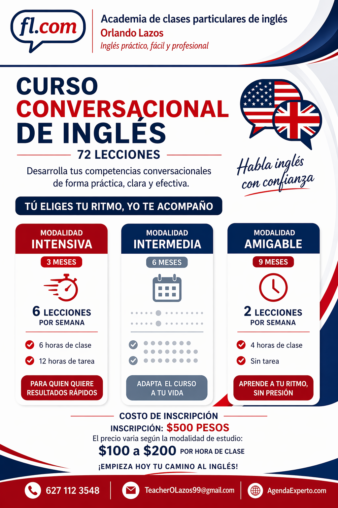
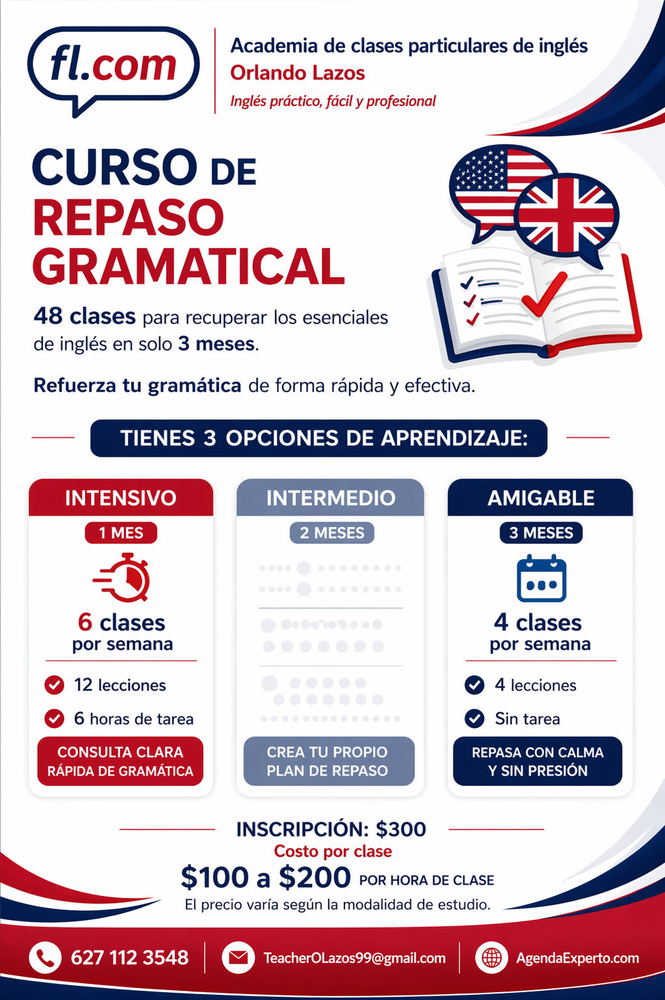
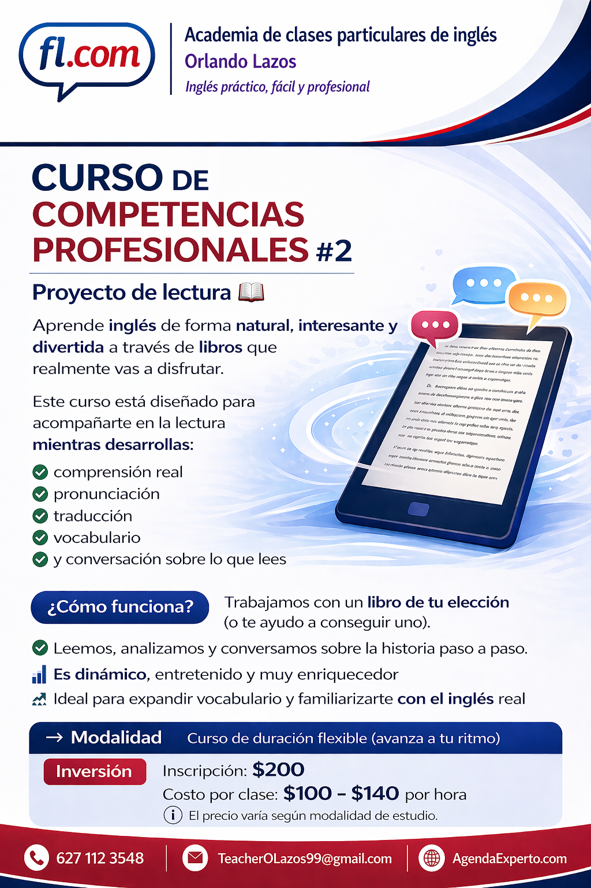

#   publicidad de apertura

##      Publicidad global

###     Descripción de las clases y curricula de mi academia

*Es un anuncio de una academia de inglés con el nombre de Orlando Lazos, donde se presentan sus clases como prácticas, fáciles y profesionales. Explica que son clases para cualquier nivel, disponibles en modalidad online y presencial, accesibles desde celular o laptop y dirigidas principalmente a mayores de 12 años. También destaca que incluyen teoría, práctica y dinámicas, son impartidas por un profesor certificado y cuentan con apoyo de inteligencia artificial. Finalmente, muestra información de contacto (teléfono y correo) junto con un diseño visual en tonos azul, rojo y blanco con una imagen de una laptop con temática de inglés.*

####    Post

**Descripción de que y cómo son mis clases**

Mis clases son para toda persona interesada que desee mejorar su inglés, desde los que empiezan en nivel 0 o los que quieren perfeccionar su pronunciación o fluidez en el idioma.

Si no sabes decir "hola" en inglés, no te preocupes, tengo un curso de inglés conversacional desde cero, lleno de lecciones divertidas que amenizaré para ti 😉

Si ya tuviste cursos en escuelas públicas y privadas, pero las clases grupales no funcionaron; si tampoco te funcionó Duolingo u otras aplicaciones, no te desanimes, no eres una excepción, aprender inglés no es sencillo sin las herramientas adecuadas. Te animo a que le des una oportunidad a las clases particulares y me encantaría que me des la confianza de acompañarte.

¿Dudas?   Te invito a revisar mi página web: `AgendaExperto.com/Teacher`, o a contactarme directamente: `6271123548`. Pero aquí lo esencial:
• Mis clases son en línea;    si vives en Parral y quieres, puedes tomarlas presencial, pero te será más cómodo en línea. 
• Puedes tomar clases   desde tu cel sin problema,    pero te sería más cómodo hacerlo en una pantalla más grande. 
• Doy clases de    doce años en adelante    (sí puedo hacer una excepción para trabajar con niños, pero son casos especiales). 
• Doy clase    para todo nivel,    desde estudiantes de nivel básico hasta avanzado que buscan perfeccionar pronunciación, mejorar gramática o impulsar su fluidez.
• Clases entretenidas:    En mis clases no solo veras teoría, veremos videos, canciones, noticias, platicas de temas variados, el chiste es hacer tus clases amenas
• Mejor que estudiar    *con Inteligencia artificial*   o con un profesional, son mis clases. Con ayuda de los modelos punteros tus clases pasarán de los típicos ejemplos aburridos y monótonos a ejemplos profesionales e interesantes.

###     Precios y cotización

Mi política de pecios es clara y transparente

*Imagen publicitaria de clases particulares de inglés con enfoque en precios claros y accesibles. Indica que las clases cuestan de $100 a $200 por hora, que el precio depende de la modalidad, y que la inscripción por curso va de $300 a $500. También resalta información clara, trato honesto y precios razonables, e incluye contacto, correo y la página AgendaExperto.com.*

####    Post
**¿Precios?**
Sí, manejo **precios económicos y transparentes**.

Me gusta ser claro desde el principio. Hay cursos y escuelas que cobran cantidades muy altas desde el inicio, incluso cuando las clases no son particulares o cuando no explican con claridad su método, su currículo o lo que realmente incluyen. En mi caso, prefiero que sepas exactamente qué estás pagando.

**Mis clases oscilan entre $100 y $200 por hora.**
El precio depende de la modalidad de estudio, ya que algunas requieren más preparación, más material para clase y más tareas personalizadas.

Además, manejo una **inscripción por curso** que oscila entre **$300 pesos - $500** con facilidad de pagar en partes.

En mi página puedes encontrar promociones o precios vigentes sin problema. Y si deseas conocer más sobre mis los cursos y su contenido puedes revisarlo en mi pagina web `AgendaExperto.com`

Si buscas clases particulares de inglés con información clara, trato honesto y precios razonables, con gusto te acompaño en tu proceso.

##   Publicidad de cursos

###  Curso de inglés conversacional

####  Curso de inglés conversacional completo 

*Curso de inglés de 72 lecciones, donde el estudiante elige su ritmo y modalidad: intensiva, intermedia (personalizada) o amigable. La modalidad intensiva propone 6 lecciones por semana con 12 horas de práctica para avanzar rápidamente, mientras que la modalidad amigable ofrece 2 lecciones por semana sin tareas. La modalidad intermedia se adapta a las necesidades del estudiante. La inscripción es de $500 MXN y el costo por clase va de $100 a $200 por hora, dependiendo de la modalidad. Incluye opciones de contacto mediante redes sociales para más información.*

#####   Post

¿Quieres aprender inglés conversacional? 🗣️✨

A tu ritmo, sin presión y con clases accesibles 💸
Te ofrezco mis servicios como profesor para acompañarte desde cero.

¿Tienes dudas? Escríbeme con confianza para una sesión informativa 😊no tiene costo.

####  Curso de inglés conversacional de repaso

*el curso de repaso gramatical consta de 48 clases que se hacen en tres meses y en una modalidad de estudio amigable, se puede hacer hasta en un solo mes, en una modalidad de estudio intensivo, con seis clases por semana, dos elecciones por semana y seis horas de tarea por semana. El costo tiene un costo de inscripción de 300 pesos y un costo por clase de 100 a 200 pesos, dependiendo de la modalidad.*

#####   Post

Curso de repaso express

Si ya estudiaste inglés pero sientes que no lo tienes bien claro… este curso es para ti.

Aquí vamos a hacer una revisión rápida y bien aterrizada de los fundamentos del inglés para que dejes de “medio entender” y empieces a usar un inglés real de verdad.

Lo puedes tomar cómodamente en solo tres meses.

Si buscas curso desde 0 o para perfeccionar tu inglés, también los puedes encontrar en mi academia de inglés. Me encuentras en AgendaExperto.com y en Facebook como `Clases particulares de inglés con Orlando`.

###  [ ] Curso de inglés profesional

####    taller de pronunciación

*El curso de pronunciación es de 38 lecciones. En la modalidad intensiva se puede acabar en un mes, que son cinco clases por semana, 10 lecciones a la semana y cinco horas de tarea. Hay una modalidad intermedia y hay una modalidad amigable. La amigable se termina en dos meses con 10 o 10 semanas, lo que vienen siendo cuatro clases por semana, ocho lecciones por semana y no se lleva tarea. El costo de inscripción es de 300 pesos, el costo por clase es de 200 por hora de clase. El precio varía según la modalidad de estudio.*

#####   Post Facebook

Puedes saber mucho inglés…
pero si no lo pronuncias bien, nadie te entiende 😅 y tu tampoco reconocerás ese mucho inglés que en teoría ya conoces.

La pronunciación es el puente entre poder leer
y poder conversar con fluidez.

Dale ese salto a tu inglés y empieza a hablar con confianza 🔥

Pide tu sesión informativa, no tiene costo.

Encuéntrame como:
Contacto: 6271123548 - TeacherOLazos99@gmail.com
Facebook: Clases particulares de inglés con Orlando
Web: AgendaExperto.com

####  [ ] Proyecto de comprensión lectora

#####   Post Facebook

Una de las maneras más efectivas y disfrutables para aprender un idioma es a través de la lectura. Te invito a tomar este curso en el que no solo aprenderás un montón, sino que también disfrutaras del proceso. Pide una sesión informativa, no tiene costo. 😉

Encuéntrame como:
Contacto: 6271123548 - TeacherOLazos99@gmail.com
Facebook: Clases particulares de inglés con Orlando
Web: AgendaExperto.com

####    Proyecto de expresión oral y escrita 

*El curso de competencias profesionales número 3 de proyecto de expresión oral y escrita es un curso que consta de 24 a 28 clases más 4 sesiones de exposición. Este curso tiene tres opciones de aprendizaje. Igual se puede hacer intensivo, intermedio o amigable. Si lo haces en intensivo, se termina en un mes, tomando seis clases por semana, ocho lecciones por semana y dos horas de tarea. O se puede hacer una intensidad amigable que se daría en dos meses, se tomarían cuatro clases por semana, se harían cuatro lecciones y no sería contraria al estudiante. También se puede hacer una modalidad intermedia. El costo de este curso es de 100 a 140 pesos, la inscripción cuesta 200 pesos y es un taller para trabajar la redacción del estudiante, su capacidad expositiva y su capacidad argumentativa. Se va a elegir un tema de su interés, él va a hacer un ensayo, lo va a exponer y lo va a dialogar en modo argumentativo.*

#####   Post Facebook

Este es un curso especial, es el cierre de tu proceso formal de aprendizaje de inglés.

Un proyecto integrador en donde la teoría y la practica se convierten en resultados reales. Ahora lo usas para crear, expresar y defender tus ideas en inglés de manera profesional.

📝 Redactas
🎤 Expones
💬 Argumentas

Un proyecto real, dinámico y guiado paso a paso…
para que puedas decir: sí, ya puedo usar el inglés profesionalmente.

💥 Aquí es donde el inglés deja de ser teoría… y se vuelve herramienta.

Contáctame para tu sesión informativa, no tiene costo.

Contacto: 6271123548 - TeacherOLazos99@gmail.com
Facebook: Clases particulares de inglés con Orlando
Web: AgendaExperto.com

