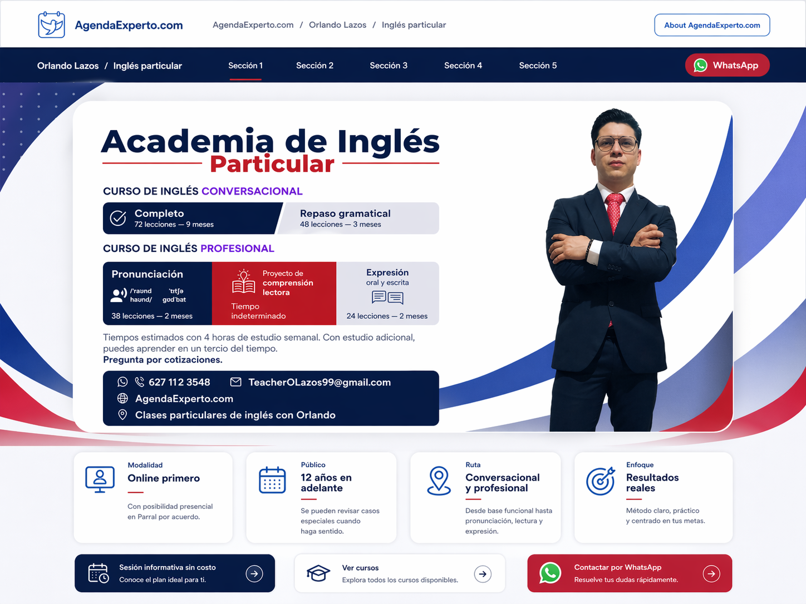
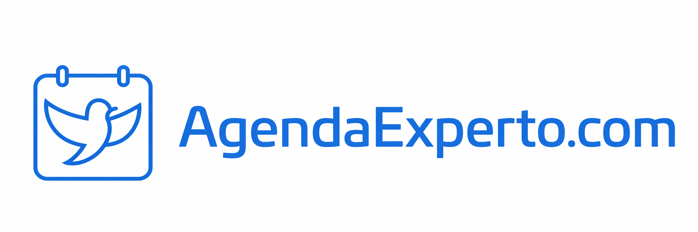

# Instrucciones para Codex: rediseño de la página “Inglés particular”

Quiero reorganizar y mejorar visualmente la página del servicio **“Inglés particular”** dentro de **AgendaExperto.com**, tomando como referencia el prediseño aprobado.

## 1) Objetivo general

La página debe verse más limpia, profesional y coherente con la portada actual.
La **portada existente no debe modificarse en su contenido**, solo debe mostrarse mejor dentro del layout general.

Quiero que:

* la portada tenga más protagonismo visual,
* se elimine el efecto de difuminado que hoy entorpece la lectura,
* la paleta de color y el estilo visual de la portada se extiendan al resto de la página,
* la navegación quede claramente dividida entre **AgendaExperto.com** y **la página del profesional**.

---

## 2) Estructura de navegación: dos menús

### Menú 1: navegación global de AgendaExperto.com

Este menú corresponde al sitio principal.

Debe incluir, en este orden:

1. **Branding / imagotipo de AgendaExperto.com** a la izquierda.

2. **Breadcrumb** que muestre la ruta actual del usuario.
3. Un botón o link clicable que diga: **About AgendaExperto.com**.
Que debe de conectar con un sitio que describa mi proyecto brevemente, puedes checar mi proyecto en `C:\Users\Orlan\OneDrive - Universidad Autónoma de Chihuahua\05 Program files\16_AgendaExperto.com\1_Directive_notes\1_Agendaexperto.md`
   No debes de incluir una descripción completa debes de poner una descripción de la visión que espero que tenga mi página y también ayudaré a personas a crear páginas web a precios reducidos/accesibles dentro de mi landing page.

### Breadcrumb esperado

La ruta debe mostrarse así:

**AgendaExperto.com / Orlando Lazos / Inglés particular** (si estoy ya en el perfil de Orlando Lazos en su servicio de clases particulares, obvio si se está en la página principal debe de aparecer solo Agenda Experto.com)

### Importante sobre “About AgendaExperto.com”

* En esta vista **solo debe aparecer el botón o enlace**.
* **No debe mostrarse aquí ningún panel desplegado ni contenido abierto**.
* Ese botón más adelante llevará a una sección o página aparte sobre el proyecto.

### WhatsApp

* **No quiero el botón de WhatsApp en el menú global de AgendaExperto.com**.
* WhatsApp debe pertenecer a la navegación del servicio profesional, no a la navegación principal del marketplace.

---

## 3) Menú 2: navegación local del profesional

Este menú aparece cuando ya se seleccionó un profesional

Debe incluir:

1. El nombre del profesional.

Una vez que se selecciono uno de sus servicios

2. El nombre del servicio.
3. Las secciones internas de esta página.

Encabezado sugerido del menú local:

**Orlando Lazos / Inglés particular**

Después de eso deben aparecer las secciones internas de la página.

---

## 4) Secciones internas de la página

Quiero que el menú del profesional navegue a secciones reales dentro de la misma página.

Puedes usar estas secciones, en este orden sugerido:

1. **Presentación general**
2. **Cursos de la academia**
3. **Metodología de enseñanza**
4. **Resultados de cada curso**
5. **Temario de los cursos**
6. **Evaluación de nivel (examen de colocación)**
7. **Sobre mí y mis credenciales**
8. **Agenda tu primera clase**
9. **Precios**
10. **Agenda tu primera clase**
11. **Medios de contacto**
12. **Preguntas frecuentes**

###   Acerca del examen de colocación
también quiero que en la introducción o la presentación general digas que para las personas que quieran aprender inglés desde su nivel actual pueden hacer un examen de colocación y que lo refieras a la sección. Y en esa sección, pues les voy a hablar de que yo les puedo aplicar un examen de colocación con un costo de 200 pesos y puedo hacer una reducción del temario. O sea, que yo les hago el examen de colocación, que se les hace un examen de colocación por 250 pesos, ellos lo contestan, me lo mandan, yo lo reviso y luego ya con ellos les hago un examen verbal para checarlos. Y, bueno, el costo del examen de colocación es de 300 pesos. Así por ahí hay un examen de colocación de 300 pesos con el cual puedo reducir el temario y ya les digo, ¿sabes qué? pues de 32 lecciones vas a terminar haciendo nomás 40, nomás 50, o te recomiendo nomás estas, o nomás te recomiendo 20, o te recomiendo esto y esto. Entonces te digo, este examen de colocación, una parte es les mandas un examen y que lo hagan pues obviamente sin asistencia, por su cuenta, y la otra parte es un examen oral de 30 minutos en el que pues les voy a hacer unas preguntas, una evaluación para checar pues su nivel actual. y el costo es de 300 pesos y ya les avisaría después qué curso les conviene. Pero sí agrega eso, por favor, lo vas a agregar tanto en la misma página web, así como también lo vas a agregar dentro de la documentación de los cursos. Quiero que lo metas en la carpeta de te vas a ir a Directive Notes y vas a crear una nueva nota, que la nota número 9 guion bajo Colocation Exam o su la traducción de examen de colocación. Pones una nota número 9 en las notas directivas. Entonces lo agregas ahí y en la página web.

### Nota de nombres

* Donde antes se hablaba de “rutas de estudio”, prefiero usar **Cursos de la academia**.
* En vez de algo ambiguo como “cómo puede avanzar un alumno”, prefiero una sección más concreta llamada **Evaluación de nivel**.
* Si lo consideras mejor para UX, puede llamarse:
  **Evaluación de nivel (examen de colocación)**
  o
  **Examen de colocación**.
  Si tienes que elegir una sola etiqueta, prefiero **Evaluación de nivel** porque se siente más clara para el usuario.

  perfecto entnoces prefeririremos el término de evaluacion de nivel (examen de colocación)

  Actualiza mi brand-cover.png en todo en donde haga falta dentro de mi proyecto, ahora incluyo examen de colocación

"C:\Users\Orlan\OneDrive - Universidad Autónoma de Chihuahua\01 Documents\04 Professional\14 Fluent Language.com\2_Code_Tools\website\assets\images\brand-cover.png"

aquí ya está actualizada, la imagen de arprobada utilizaba la imagen que not tiene esta actualizacion asegurate de que no quede fuera en esta iteración

---

## 5) Portada / hero principal

La portada actual debe mantenerse como imagen principal del hero.

que esté actualizada de aquí
"C:\Users\Orlan\OneDrive - Universidad Autónoma de Chihuahua\01 Documents\04 Professional\14 Fluent Language.com\2_Code_Tools\website\assets\images\brand-cover.png"

### Requisitos para mostrarla

* Debe mostrarse **más grande y más limpia**.
* **No usar difuminado encima** que afecte la legibilidad.
* Debe integrarse mejor con la página, no verse como una imagen “pegada” sin contexto.
* Puede ir dentro de un contenedor elegante, con bordes redondeados y buen espacio en blanco.
* La portada debe dominar visualmente la parte superior de la página.

Checar diseño preaprobado `Approved preview`

### Dirección visual

Quiero que el resto de la página herede el lenguaje visual de la portada:

* azul marino,
* azul brillante,
* rojo,
* blanco / gris muy claro,
* formas curvas suaves,
* sensación profesional y moderna.
* Poco uso de morado para llamar la atención, exclusividad

### Sobre la foto

La foto ya viene integrada en la portada, así que:

* no quiero una edición rara de la foto,
* no quiero duplicar la foto innecesariamente,
* el objetivo es **presentar mejor la portada**, no rehacerla.

---

## 6) Tarjetas de acceso rápido debajo de la portada

Debajo del hero quiero una fila o grid de **tarjetas de acceso rápido**.

Estas tarjetas deben:

* ser visualmente atractivas,
* tener ícono + título + breve texto descriptivo,
* ser clicables,
* llevar al usuario a la sección correspondiente dentro de la misma página.

Estas tarjetas sirven como **preview visual** de las secciones principales.

### Tarjetas sugeridas

Quiero que representen estas áreas:

1. **Información general**

   * breve resumen del servicio y modalidad.

2. **Cursos de la academia**

   * acceso a la parte donde se explican los cursos disponibles.

3. **Metodología de enseñanza**

   * cómo se trabaja en clase.

4. **Resultados del curso**

   * qué puede esperar el alumno al avanzar.

5. **Temario de los cursos**

   * acceso a la parte donde se despliega el contenido o currícula de cada curso.

6. **Evaluación de nivel**

   * acceso a la sección donde se explica el examen de colocación o diagnóstico inicial.

7. **Sobre mí y credenciales**

   * experiencia, perfil y certificaciones.

8. **Precios**

   * costos, modalidades o rangos de precio.

9. **Agenda tu primera clase**

   * CTA clara para iniciar contacto o reservar.

10. **Preguntas frecuentes**

* dudas comunes.

> Respecto de la redacción
> La redacción debe de ser en esapañol y escrita en primera pesona soy yo hablando a las personas de mí o de sus cursos o de sus beneficios. No uses descripciones en tercera persona, sino un tono más amigable y cercano.

### Recomendación de implementación

No es obligatorio que estén las 10 arriba visibles en una sola fila.
Puedes resolverlo con:

* varias filas,
* grid responsivo,
* o priorizar 6 principales y dejar las demás como secciones abajo.

> Prerferiría si es posible con diseño estático de la página, que se pueda hacer una desplazamiento a lateral infinito, tipo feed de peliculas, claro sería circular  de las secciones

Pero sí quiero que visualmente quede claro que esas tarjetas son accesos rápidos a la información importante.

---

## 7) Temario de los cursos

Debe existir una sección específica llamada:

**Temario de los cursos**

o, si queda mejor visualmente:

**Currícula de los cursos**

Esta sección debe permitir ver **qué compone cada curso**.

La idea es que allí aparezcan los cursos y, dentro de cada uno, un sistema desplegable o acordeón con su contenido.

Ejemplo de comportamiento:

* Curso conversacional completo
* Repaso gramatical
* etc.

Y al hacer clic, se desplieguen las clases, módulos o componentes.

---

## 8) Sobre mí y credenciales

Debe haber una sección llamada algo como:

**Sobre mí y credenciales**

o

**Experiencia y credenciales**

Aquí irá información sobre:

* quién soy,
* mi experiencia,
* mis certificaciones,
* mi perfil profesional.

---

## 9) Agenda tu primera clase

Debe haber una sección / CTA (call to action) importante llamada:

**Agenda tu primera clase**

Esta debe funcionar como llamada a la acción principal del servicio.

Puede enlazarse a:

* WhatsApp,
* formulario, que recopile datos, de momento no he incorporado el codgio para conectarlo a una base de datos, pero aunque no se pueda, dejalo como una tarea pendiente en las iteraciones registral en el change log, y en la visión de arquetipo que debe de haber un formulario que pida datos personales. De momento ponlo y cuando el usuario lo clique responde, función aún no soportada, pero mandame un wpp y me quedo con tus datos, y que al dar click se vaya a mandarme un mesnaje, 6271123548
* o agenda futura. (también es una funcón a incorporar a futuro, cuando ya haya calanedario dentro de AX.com)

---

## 10) Estilo visual esperado

Quiero una interfaz:

* limpia,
* moderna,
* profesional,
* con jerarquía visual clara,
* con buen espaciado,
* con tarjetas y contenedores elegantes,
* con consistencia en colores y tipografía.

### Estilo de componentes

* tarjetas con bordes redondeados,
* sombras suaves,
* navegación clara,
* íconos simples,
* botones visibles,
* secciones bien separadas.

---

## 11) Comportamiento esperado

* El menú global y el menú local deben diferenciarse visualmente.
* Las tarjetas de acceso rápido deben llevar al usuario a secciones reales.
* El breadcrumb debe ser visible.
* “About AgendaExperto.com” debe aparecer solo como enlace/botón, sin desplegar contenido aquí.
* WhatsApp debe pertenecer al contexto del servicio profesional.
* El layout debe ser responsivo, pero priorizando una buena vista de escritorio.

---

## 12) Resumen corto de la intención

En resumen, quiero que esta página se entienda como:

* **un servicio profesional dentro de AgendaExperto.com**,
* con **doble navegación** (sitio principal + navegación local del profesional),
* con una **portada protagonista**,
* y con **tarjetas de acceso rápido** que guíen al usuario a las secciones clave:
  cursos, metodología, resultados, temario, evaluación de nivel, credenciales, precios y agenda.

---

Si quieres, en el siguiente mensaje te lo convierto en una versión todavía más práctica, tipo:

**“Prompt técnico para Codex”**
más corto, más directo y listo para pegar.
